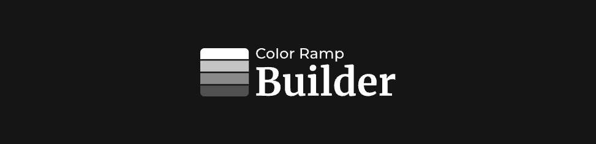

# Color Ramp Builder
Color Ramp Builder is an App made for designers and for developers, facilitating the creation of custom and dynamic color ramps for design systems and other implemenattions.

## Installation
The application is compatible with Windows and MacOS. Installers for both platforms are available as ZIP files in the [releases](https://github.com/Armando-Cierra/color-ramp-builder/releases) section.

## Web Version
A web version of the application is also available and can be accessed [here](https://color-ramp-builder.netlify.app/)

## Dependencies Used
- [reactJS](https://react.dev/)
- [typescript](https://www.typescriptlang.org/)
- [electronJS](https://www.electronjs.org/)
- [react-router-dom](https://reactrouter.com/)
- [i18next](https://www.i18next.com/)
- [chroma-js](https://gka.github.io/chroma.js/)
- [react-colorful](https://omgovich.github.io/react-colorful/)
- [framer-motion](https://motion.dev/)
- [@tabler/icons-react](https://tabler.io/icons)
- [classnames](https://github.com/JedWatson/classnames#readme)
- [react-tooltip](https://github.com/ReactTooltip/react-tooltip#readme)
- [react-toastify](https://fkhadra.github.io/react-toastify/introduction/)
- [react-focus-lock](https://github.com/theKashey/react-focus-lock#readme)
- [react-outside-click-handler](https://github.com/airbnb/react-outside-click-handler#readme)
- [uid](https://github.com/lukeed/uid#readme)
